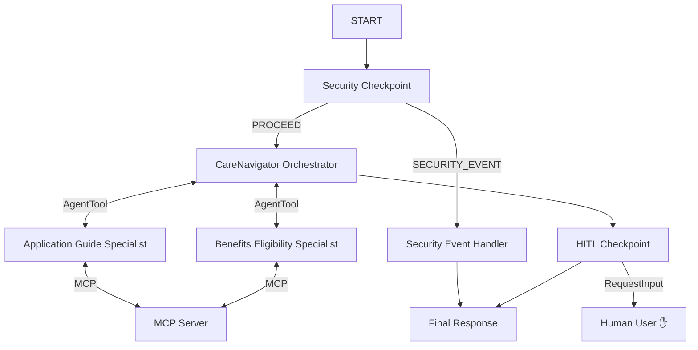

# CareNavigator — Submission Write-Up

## Problem Statement
Navigating local, state, and federal welfare benefits (Medicaid, SNAP, LIHEAP) is a notoriously difficult task. Eligibility guidelines are complex, document requirements are confusing, and administrative rules change frequently. This complexity disproportionately impacts the elderly and low-income individuals, who may miss out on vital assistance due to administrative friction. 

**CareNavigator** is an intelligent, secure, multi-agent coordinator that simplifies this process by answering eligibility questions, outlining required documents, finding local offices, and preparing users for applications.

## Solution Architecture

## Concepts Used

1. **ADK 2.0 Graph Workflow API**:
   - Implemented in [app/agent.py](file:///c:/Users/benher/Downloads/adk_workspace/care-navigator/app/agent.py). Orchestrates the flow from input security validation down to the final response and human interaction checkpoint.
2. **LlmAgent**:
   - The coordinator (`care_navigator_orchestrator`) and specialized sub-agents (`benefits_eligibility_agent`, `application_guide_agent`) are all defined as separate, modular `LlmAgent` instances in [app/agent.py](file:///c:/Users/benher/Downloads/adk_workspace/care-navigator/app/agent.py).
3. **AgentTool**:
   - Enables the coordinator to delegate tasks dynamically to specialized sub-agents based on the user's inquiry, preserving context and boundaries. Defined in [app/agent.py](file:///c:/Users/benher/Downloads/adk_workspace/care-navigator/app/agent.py#L90-L105).
4. **MCP Server**:
   - Created in [app/mcp_server.py](file:///c:/Users/benher/Downloads/adk_workspace/care-navigator/app/mcp_server.py) using the MCP Python SDK. Exposes domain-specific calculations, office searches, and program rules.
5. **Security Checkpoint Node**:
   - Implemented as a function node `security_checkpoint` at the graph start in [app/agent.py](file:///c:/Users/benher/Downloads/adk_workspace/care-navigator/app/agent.py#L111-L169) to screen inputs for prompt injection and PII leaks.
6. **Agents CLI**:
   - Scaffolded with `agents-cli scaffold create --deployment-target agent_runtime` to set up deployment targets and local virtual environment.

## Security Design

- **PII Scrubbing**: Regex filters automatically replace Social Security Numbers (SSNs) and phone numbers with placeholders. This ensures users do not accidentally transmit highly sensitive information to the language model.
- **Prompt Injection Guardrails**: Blocks attempts to hijack the workflow or expose system prompts (e.g., using `ignore previous instructions`).
- **Domain-Specific Consent Check**: Checks queries targeting other people (e.g., "my mother" or "spouse"). If no statement of consent or permission is present in the query, the security check blocks the query, prompting the user for authorization.
- **JSON Audit Log**: Every security decision prints a structured audit log containing scrubbing status, violation reports, and severity level (`INFO`/`WARNING`/`CRITICAL`) for administrative monitoring.

## MCP Server Design

The local MCP server ([app/mcp_server.py](file:///c:/Users/benher/Downloads/adk_workspace/care-navigator/app/mcp_server.py)) exposes 3 specialized tools:
1. `lookup_benefit_rules`: Returns specific rules and residency requirements for Medicaid, SNAP, and LIHEAP.
2. `check_income_threshold`: Compares user household size and gross income against simulated 2026 Federal Poverty Level limits.
3. `search_local_offices`: Searches a mock directory of physical administration offices and drop-off centers by zip code.

## Human-in-the-Loop (HITL) Flow

A crucial element of social benefit applications is confirming that the applicant has the necessary documentation. 
- The `hitl_checkpoint` node (implemented in [app/agent.py](file:///c:/Users/benher/Downloads/adk_workspace/care-navigator/app/agent.py#L178-L216)) automatically scans response content for application instructions.
- If it detects that the user is ready to apply, the workflow halts and yields a `RequestInput` payload.
- The user is asked: *"Please confirm if you have the following documents ready to apply: [Checklist]..."*
- Once the user replies in the playground, the workflow resumes and processes the confirmation state.

## Demo Walkthrough

1. **Test Case 1: Eligibility Check**: The user inputs income and household details. The agent performs FPL checks using the MCP tool, and returns an eligibility estimation for SNAP.
2. **Test Case 2: Document Checklist & HITL**: The user asks how to apply for Medicaid. The workflow displays document requirements and prompts the user to confirm they have them.
3. **Test Case 3: Prompt Injection Blocked**: The user attempts an adversarial attack. The security checkpoint instantly blocks the prompt and returns a safe security alert.

## Impact / Value Statement
CareNavigator bridges the digital divide for vulnerable populations by acting as a compassionate, safe, and highly accurate intermediary. By pre-screening eligibility and ensuring users have the correct documents before visiting local offices, it reduces administrative waste, speeds up application processing times, and helps ensure that individuals receive the food, healthcare, and energy assistance they qualify for.
